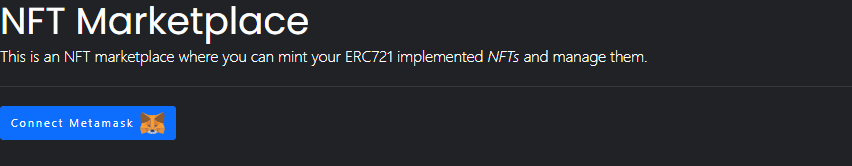
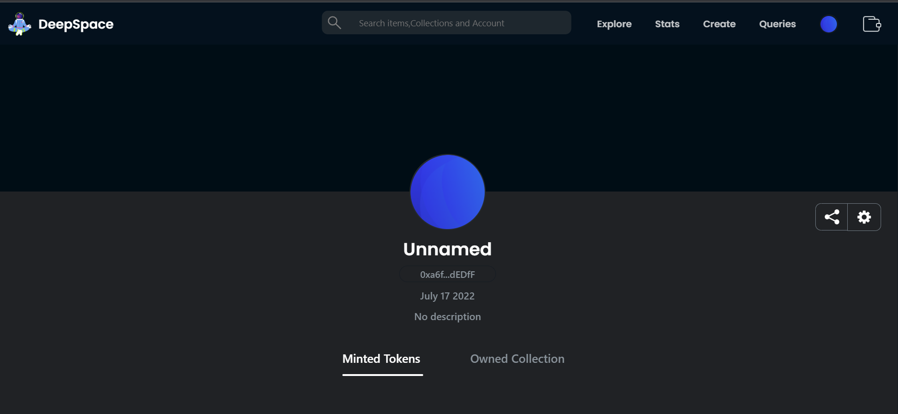
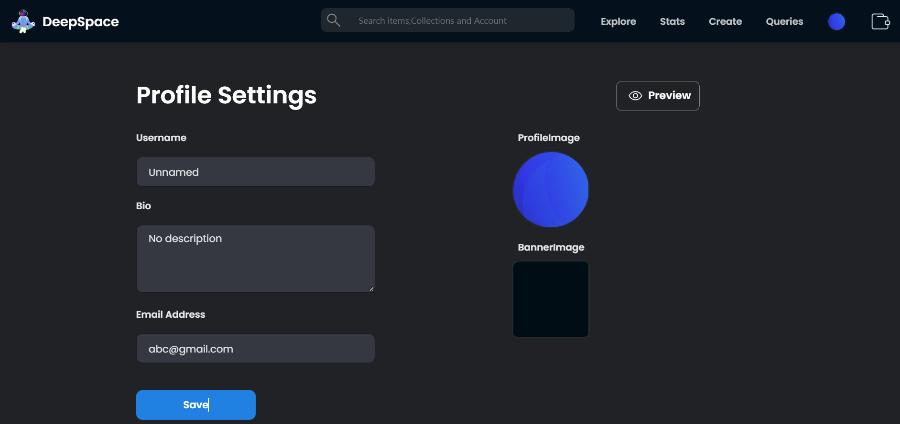
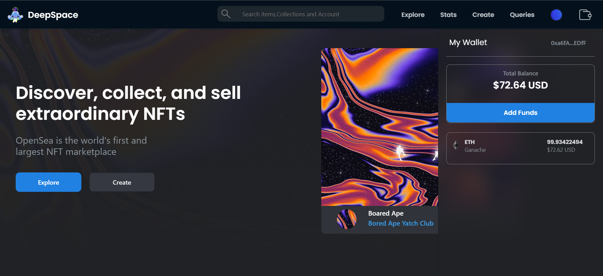
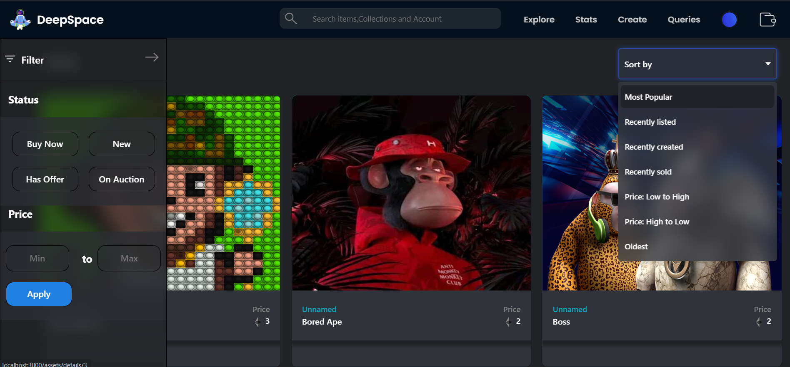
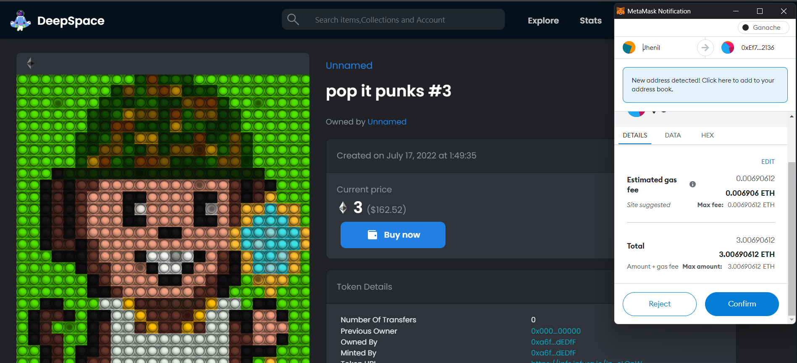
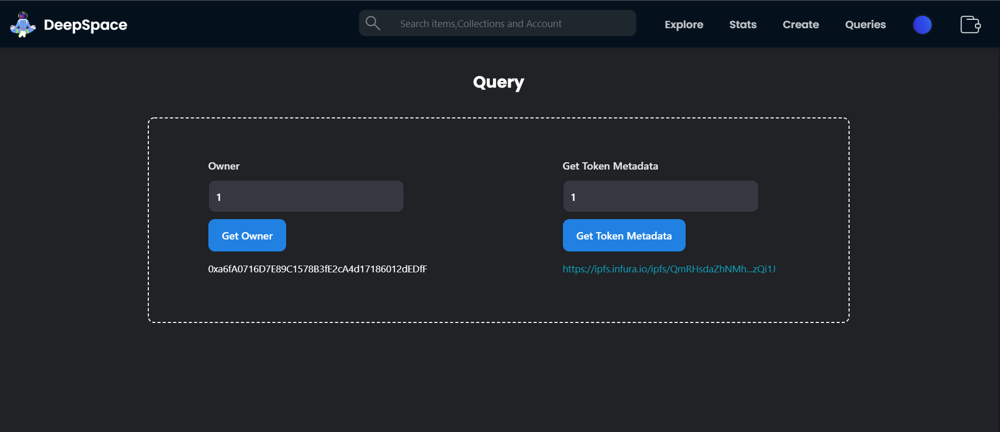

<p align="center">
 
         
        </p>
<h1 align="center"> DeepSpace </h1>
<h3 align="center"> Blockchain Based NFT marketplace DApp where users mint ERC721 implemented NFTs.<h3>

<div align="center">
  
 
  [](https://github.com/facebook/create-react-app)
   [](https://www.ethereum.org/)
    
  
   
<!--   
   -->
 </div>
  
  ## DeepSpace : About
- It is a blockchain based project for Trading Nft's. 
- It works on the idea that: “All the users can buy,sell,mint/create their Nft's or can just view Nft's that are created by other people in the world” The entire process       works on the blockchain in partnership with the IPFS(to provide data security). 
- Does Everything for Nft's : Creating ,Selling and Buying .
- Thus this is a modern way to manage and trade Nft's!
- This is my Diploma Final year Project.
  
## Insight
- It is D-App on [Ethereum](https://www.ethereum.org/).
- Back-End has Smart Contract 
- Front-end of our Web-App is made with [React.Js](https://github.com/facebook/create-react-app)   
- All User-Data is stored on [IPFS](https://ipfs.io/) also every data is first encryted locally and then send to ipfs to have more security
<p align="center">
 
</p>


- We are using [Metamask](https://metamask.io/) Browser Extension to work with Ethereum.
- We have used [Truffle](https://www.trufflesuite.com/) for testing our project
  
  
  
  ## How to Use

### Signup/Login
- Connect to metamask
  <p align="center">
 
</p>
  
  
 - Upon First Signup `Metamask` User Profile will be set to default values.
 
 <p align="center">
 
</p>  
  
  - You can edit your profile by going to the profile Setting page.
 
 <p align="center">
 
</p>  
  
  - Landing page.
 
 <p align="center">
 
</p> 
  
  
  - Landing page have these options :
 
         - `Create`
              - User's can create their Nft's by going to the create section. They can upload their artwork , give it name, set appropriate price and description.
 
         - `Explore`
              - User's can Explore all the Nft's that have been minted by all users on our site. On the explore page user will get some filter options like recently minted or getting Nft's between specific price range(some filters are yet to be added still working on it).
 
- Create page.
      - User's can create their Nft's by going to the create section. They can upload their artwork , give it name, set appropriate price and description.
 <p align="center">
 
</p> 
- Explore page.
    - User's can Explore all the Nft's that have been minted by all users on our site. On the explore page user will get some filter options like recently minted or getting Nft's between specific price range(some filters are yet to be added still working on it).
 <p align="center">
 
</p> 
- Nft Details page.
    - User's can view details about a particular Nft by clicking on it(nft info includes: Nft image, Creator, Current Owner,Previous Owner,Buy Option,if owner[then keep for sale/remove from sale option and change price option],description).
 <p align="center">
 
</p> 
- Buy Nft by clickinh on buy button
 <p align="center">
 
</p> 
  - Query page.
    - User's can Query details about a particular Nft by the Id of it ,user can get address of the owner an csn get metadata about a particular nft by using its Id.
 <p align="center">
 
</p> 

#
### Stack
- [Solidity](https://docs.soliditylang.org/en/v0.7.6/) - Object-oriented, high-level language for implementing smart contracts.
- [Bootstrap 4](https://getbootstrap.com/) - CSS framework for faster and easier web development.
- [React.js](https://reactjs.org/) - JavaScript library for building user interfaces.
- [web3.js](https://web3js.readthedocs.io/en/v1.3.4/) - Allows users to interact with a local or remote ethereum node using HTTP, IPC or WebSocket.
- [Truffle](https://www.trufflesuite.com/truffle) - Development environment, testing framework and asset pipeline for blockchains using the Ethereum Virtual Machine (EVM).
- [Ganache](https://www.trufflesuite.com/ganache) - Personal blockchain for Ethereum development used to deploy contracts, develop DApps, and run tests.
#
### Interact with the deployed DApp
- Marketplace DApp requires [Metamask](https://metamask.io/) browser wallet extension to interact with.
- Connect metamask browser wallet to Localhost 7545 running a custom RPC like Ganache.
<!-- - Access Marketplace DApp at [NFT-marketplace]() and start minting your NFTs. -->
#
### Run the DApp Locally
#### Install truffle
```
npm install -g truffle
```
#### Install ganache-cli
```
npm i ganache-cli
```
#### Run ganache-cli
```
ganache-cli --port 7545
```
#### Open new terminal window and clone this repository
```
git clone https://github.com/HarshDilipGhosalkar/DeepSpace.git
```
#### Install dependencies
```
cd DeepSpace
npm install
```
#### Compile smart contract
```
truffle compile
```
#### Deploy smart contract to ganache
```
truffle migrate
```
#### Test smart contract
```
truffle test
```
#### Start DApp
```
npm start
```
- Open metamask browser wallet and connect network to Localhost 7545.
- Import accounts from ganache-cli into the metamask browser wallet to make transactions on the DApp.
  -------------------------------------
  ## Contributing
  - We're are open to enhancements & bug-fixes.
  - Feel free to add issues and submit patches.
  ## Authors
  - Harsh Ghosalkar - [HarshDilipGhosalkar](https://github.com/HarshDilipGhosalkar)
  - Jhenil Parihar - [JhenilParihar](https://github.com/jhenilparihar)
## License
This project is licensed under the MIT
